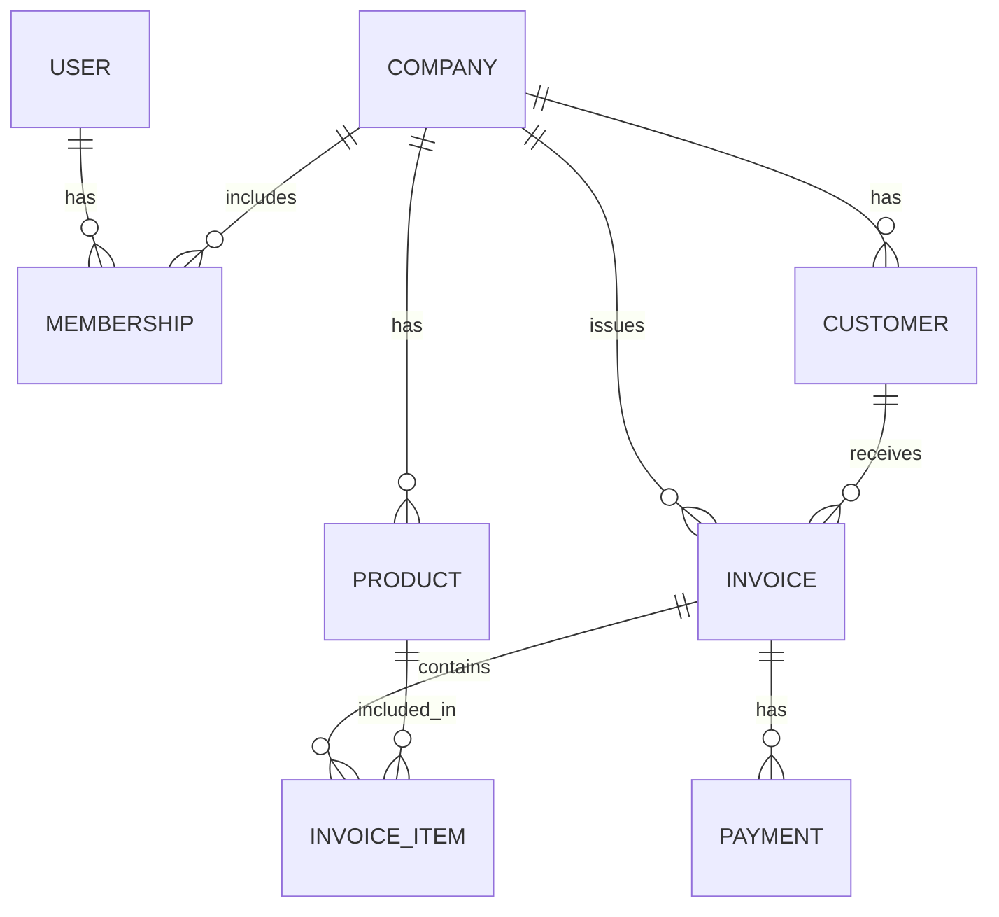

# InvoiceFlow

InvoiceFlow is a comprehensive, multi-tenant Django-based application designed for B2B SaaS invoicing. It allows users to seamlessly manage companies, clients, products, invoices, and payments, all from a unified dashboard.

## Key Features

- **Multi-Tenant Architecture**: Users can create and manage multiple companies and switch between them effortlessly.
- **Client & Product Management**: easily add, edit, and manage clients and products for each company.
- **Invoice Generation & Management**: 
  - Create and manage invoices with various statuses (Draft, Sent, Paid, Overdue, Cancelled).
  - Automatically calculate subtotals, taxes, and discounts.
  - Generate and download invoices as PDF documents (powered by ReportLab).
- **Payment Tracking**: Record payments against specific invoices using different payment methods (Cash, UPI, Card, Bank Transfer).
- **Interactive Dashboard**: View key metrics such as total revenue, pending amounts, overdue invoices, and recent activity at a glance.
- **Role-based Access**: Users can have different roles (Owner, Admin, Staff) within a company.
- **Reporting**: Export reports for business analytics.

## Tech Stack

- **Backend**: Python, Django
- **Database**: PostgreSQL
- **PDF Generation**: ReportLab
- **Frontend**: HTML/CSS templates (Django Templates)

## Setup and Installation

1. **Clone the repository** (if you haven't already).
2. **Create a virtual environment** and activate it:
   ```bash
   python -m venv venv
   source venv/bin/activate  # On Windows use `venv\Scripts\activate`
   ```
3. **Install dependencies**:
   Make sure you have Django and ReportLab installed.
   ```bash
   pip install django reportlab
   ```
4. **Run Database Migrations**:
   ```bash
   python manage.py makemigrations
   python manage.py migrate
   ```
5. **Start the Development Server**:
   ```bash
   python manage.py runserver
   ```
6. **Access the Application**:
   Open your browser and navigate to `http://127.0.0.1:8000/`.

## Architecture & Codebase Details

### Entity-Relationship Diagram



### Codebase Structure

- `InvoiceFlow/` (Project Root): Contains project-wide settings, routing (`urls.py`), and ASGI/WSGI configurations.
- `myapp/`: The core Django application.
  - **`models.py`**: Defines the database schema (Company, Customer, Product, Invoice, InvoiceItem, Payment, Membership). It enforces multi-tenancy by linking most entities to a `Company`.
  - **`views.py`**: Contains the business logic. It handles authentication, data manipulation, template rendering, dashboard metrics computation, and PDF invoice generation via ReportLab.
  - **`urls.py`**: Maps application routes to the corresponding views.
  - **`templates/`**: Contains all HTML files used by the application, utilizing the Django Template Language (DTL) for dynamic content rendering.
  - **`admin.py`**: Configuration for the Django admin interface.