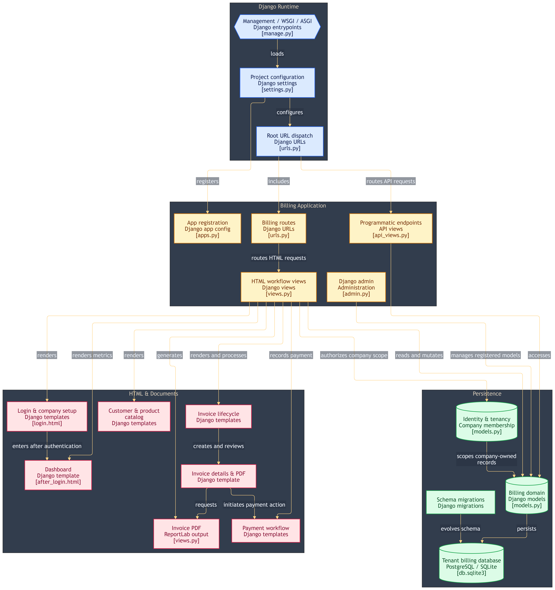
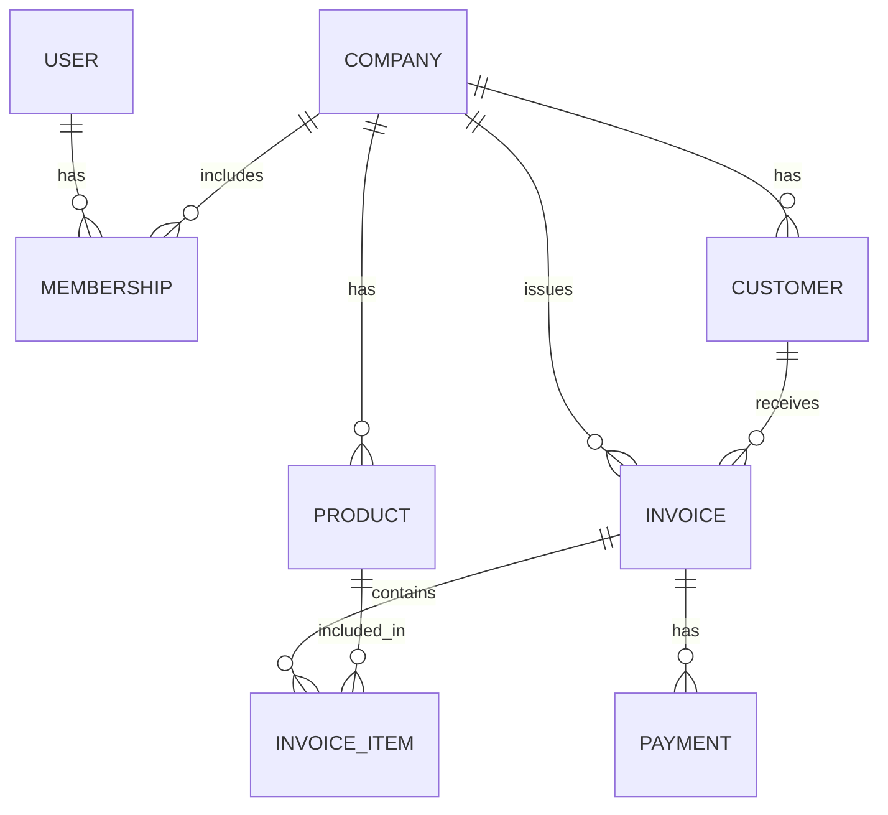

# 🚀 InvoiceFlow

## 💡 Why InvoiceFlow?

InvoiceFlow is a comprehensive, multi-tenant Django-based application designed for B2B SaaS invoicing. It was built to eliminate the hassle of managing multiple companies, clients, products, invoices, and payments by providing a unified, centralized dashboard for businesses of all sizes.


## ✨ Features

### 🎯 Core Features
- **Multi-Tenant Architecture**: Users can create and manage multiple companies and switch between them effortlessly.
- **Company-level Data Isolation**: Ensure your clients, products, and invoices are kept strictly tied to the active company.
- **Company Membership & Roles**: Users can belong to companies, and memberships support Owner, Admin, and Staff roles.
- **Interactive Dashboard Analytics**: View key metrics such as total revenue, pending amounts, overdue invoices, and recent activity at a glance.

### 🏢 Client & Product Management
- **Customer/Client Management**: Easily add, edit, and manage clients for each company.
- **Product Catalog Management**: Manage products or services with pricing and tax details.

### 🧾 Invoice Generation & Management
- **Invoice Creation**: Create invoices and add multiple invoice items to accurately bill your customers.
- **Automated Calculations**: Automatically calculate subtotals, taxes, and discounts to compute total amounts based on invoice items.
- **Invoice Status Tracking**: Invoices automatically track their state. When created, they are marked as SENT. They transition to PAID when fully paid, and handle OVERDUE statuses for past-due invoices. Invoices can also be cancelled.
- **Invoice Search/Filtering**: Easily locate and filter specific invoices from your dashboard.
- **PDF Generation**: Generate and download invoice-specific PDF documents using ReportLab.

### 💳 Automatic Payment Tracking
- **Automatic Updates**: When payments are recorded, the system automatically calculates the total amount paid, remaining balance, invoice payment status, and dashboard financial metrics.
- **Flexible Payments**: The system supports partial payments, full payments, and includes overpayment validation.
- **Multi-Method Support**: Record payments against specific invoices using different payment methods (Cash, UPI, Card, Bank Transfer).

### 📊 Reporting & Analytics
- **Financial Report PDF**: Company-level financial reports can be generated and downloaded as PDF documents using ReportLab.

## 🛠️ Tech Stack

### Backend
- **Python 3** - Core programming language
- **Django 5.x** - High-level Python Web framework
- **PostgreSQL** - Primary robust relational database
- **ReportLab** - PDF generation engine

### Frontend
- **HTML, CSS, and JavaScript** - Structure, styling, and basic client-side behavior
- **Django Templates (DTL)** - Server-side rendering for dynamic pages

## 📦 Installation

### Prerequisites
- **Python** (v3.10 or higher)
- **pip** (Python package installer)
- **PostgreSQL** (Installed and running)
- **Git**

### Setup Instructions

1. **Clone the Repository**
   ```bash
   git clone https://github.com/SharveshC/InvoiceFlow.git
   cd InvoiceFlow
   ```

2. **Create a Virtual Environment**
   ```bash
   python -m venv venv
   source venv/bin/activate  # On Windows use `venv\Scripts\activate`
   ```

3. **Install Dependencies**
   ```bash
   pip install -r requirements.txt
   ```

4. **Configure Environment Variables**
   Create a `.env` file in the root directory:
   ```env
   SECRET_KEY=your-django-secret-key
   DB_NAME=invoiceflow
   DB_USER=postgres
   DB_PASSWORD=your-db-password
   DB_HOST=localhost
   DB_PORT=5432
   ```

5. **Run Database Migrations**
   ```bash
   python manage.py migrate
   ```

6. **Create a Superuser (Optional)**
   ```bash
   python manage.py createsuperuser
   ```

7. **Run Development Server**
   ```bash
   python manage.py runserver
   ```
   
   The app will be available at `http://localhost:8000/`

## 🎮 Usage

### Getting Started

1. **Sign Up / Login / Logout**
   - Navigate to the landing page and sign up for a new account or log in securely.
   
2. **Create a Company**
   - Upon logging in, create your first company to start managing its billing.
   - Switch between multiple companies from the top navigation bar.

3. **Add Clients & Products**
   - Navigate to the "Clients" section to add new customers.
   - Go to "Products" to build your catalog of services or items.

4. **Generate Invoices**
   - Click on "Create Invoice" and select a client.
   - Add products/items, adjust quantities, and apply discounts or taxes.
   - Download the invoice-specific PDF document.

5. **Record Payments**
   - When a client pays, go to the invoice and click "Record Payment".
   - Select the payment method and enter the amount. The dashboard metrics will update automatically.

## 🏗️ Architecture & Codebase Details

### 📊 System Architecture



### 🗄️ Entity-Relationship Diagram



### 📁 Project Structure

```
InvoiceFlow/
├── .env                   # Environment variables (not in repo)
├── .gitignore             # Git ignore rules
├── manage.py              # Django CLI utility
├── README.md              # Project documentation
├── InvoiceFlow/           # Project configuration
│   ├── __init__.py
│   ├── asgi.py
│   ├── settings.py        # Database (PostgreSQL), Apps, and Middleware config
│   ├── urls.py            # Global URL routing
│   └── wsgi.py
└── myapp/                 # Core Django Application
    ├── admin.py           # Admin panel configuration
    ├── apps.py            # App configuration
    ├── models.py          # Database schema (Company, Invoice, Customer, etc.)
    ├── views.py           # Business logic, dashboard metrics, PDF generation
    ├── urls.py            # App-level routing
    ├── templates/         # HTML templates (Django Template Language)
    └── migrations/        # Database migration files
```

## 📝 License

This project is licensed under the MIT License - see the [LICENSE](LICENSE) file for details.

## 👥 Contributors

- **Sharvesh C**  
  GitHub: [@SharveshC](https://github.com/SharveshC)